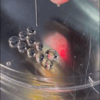

Simple Dot Grid Python GCODE Generator for 3D / Bio / Printer

**************************************************************************************

DISCLAIMER

This software is an experimental GCODE generator created specifically for a custom Bio Printer. It is intended for research and personal use only.

Use at your own risk.

The software is provided "as is", without warranty of any kind, either express or implied, including but not limited to the warranties of merchantability, fitness for a particular purpose, or noninfringement.

The creator(s) are not responsible for any damages or consequences arising from the use of this tool, including but not limited to any printer malfunctions, injuries, or other unexpected outcomes.

By using this software, you acknowledge and accept the risks involved.

**************************************************************************************

Always check your generated GCODE on a simulator before loading it on your printer.
I normally use [NCViewer](https://ncviewer.com/)

Available Parameters:

width=100,
height=100,
points_x=10,
points_y=10,
print_height=0.2,
z_hop=5.0,
flow_rate=0.017,
travel_speed=600,
extrude_speed=60,
origin_x=160,
origin_y=140,
pause_time_ms=4000

